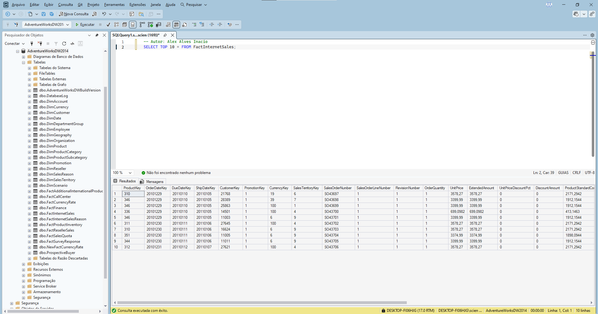
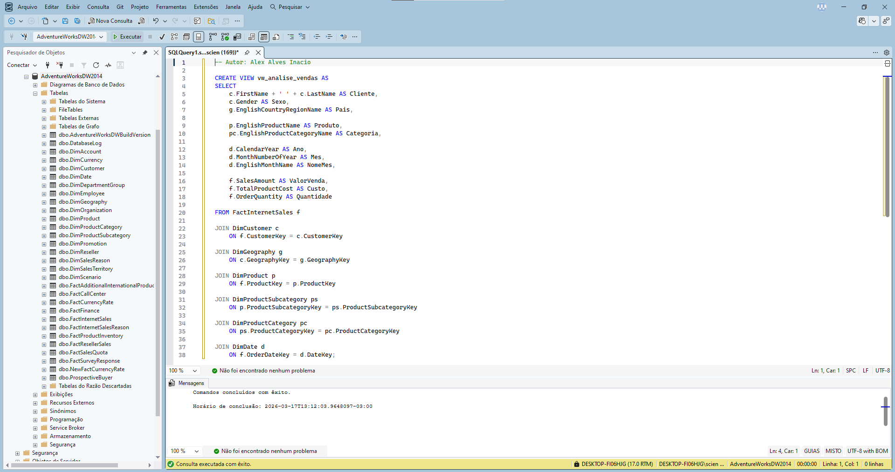
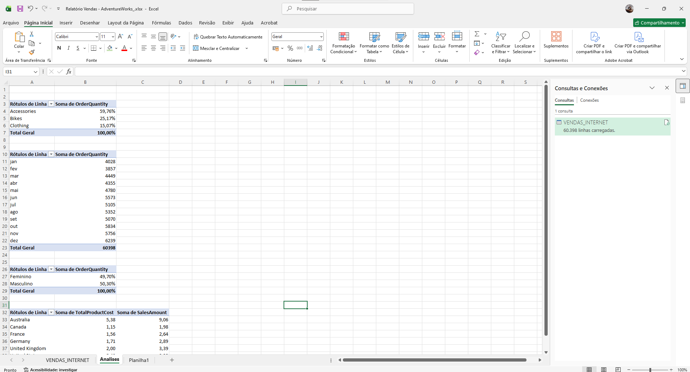

# 📊 SQL + Excel Sales Analysis | Adventure Works

Este projeto demonstra uma análise completa de vendas utilizando SQL Server e Excel, com construção de dashboard interativo e geração de insights estratégicos.

---

## 🧠 Objetivo

Analisar dados de vendas da base Adventure Works utilizando SQL para transformação de dados e Excel para visualização e construção de dashboards.

---

## 🛠️ Tecnologias utilizadas

- SQL Server
- Excel (Tabelas Dinâmicas e Dashboards)
- Modelagem de dados
- Análise de dados

---

## 📂 Etapas do Projeto

### 🔹 1. Consulta e extração de dados

---

### 🔹 2. Criação de view para análise

---

### 🔹 3. Validação dos dados

---

### 🔹 4. Análises no Excel (Base de dados)

---

### 🔹 5. Construção das análises (Tabelas Dinâmicas)

---

### 🔹 6. Dashboard Final

---

## 📊 Principais Insights

- Accessories representa aproximadamente **59,76% do faturamento total**
- Dezembro é o mês com maior volume de pedidos (**6.239 vendas**)
- Estados Unidos é o principal mercado em receita e custo
- Existe forte concentração de receita em uma única categoria (Accessories)

---

## 📁 Estrutura do Projeto

---

## 🎯 Resultado

Desenvolvimento de um dashboard interativo com KPIs e análises estratégicas, permitindo uma visão clara do desempenho de vendas e suporte à tomada de decisão.

---

## 🚀 Autor

**Alex Alves Inácio**
